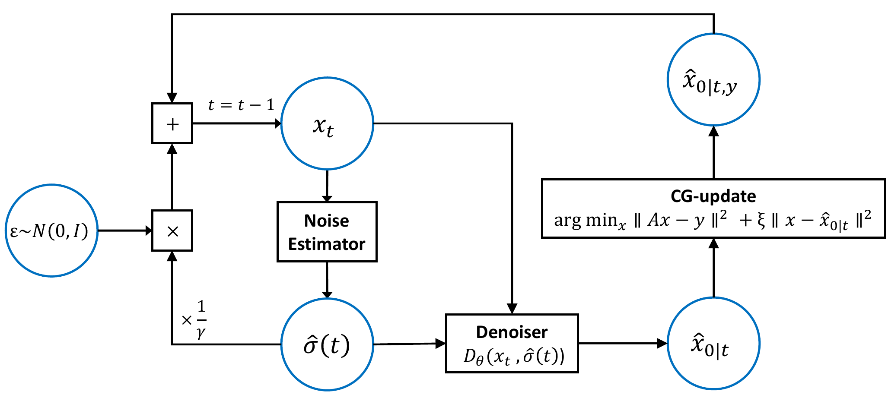

# Noise-Aware Adaptive Diffusion Sampling for Accelerated Knee MRI Reconstruction

Official implementation of "Noise-Aware Adaptive Diffusion Sampling for Accelerated Knee MRI Reconstruction".

## Abstract 

We present Noise-Aware Adaptive Diffusion sampling (NAD), a novel approach combining a classical noise estimation method with diffusion models for accelerated MRI reconstruction. NAD incorporates a data-consistent least-squares reconstruction as an informed starting point and uses patch-based Principal Component Analysis (PCA) to estimate the current noise level, thereby guiding adaptive sampling in the diffusion process. The method further incorporates conjugate gradient-based data consistency updates and controlled noise injection, meaning it re-injects Gaussian noise calibrated to the estimated noise level $\hat{\sigma}(t)$ and scaled by $\gamma$ to efficiently explore the solution space. Evaluated on the Stanford Knee MRI dataset, NAD achieves higher Peak Signal-to-Noise Ratio (PSNR) than competing diffusion-based methods across the tested sampling budgets, with competitive or superior Structural Similarity Index (SSIM), while reducing reconstruction time in the main low-to-moderate sampling regimes. The proposed method not only advances accelerated MRI reconstruction but also provides insights into efficiently leveraging diffusion models for inverse problems in medical imaging.



## Installation

```bash
conda env create -f environment.yml
conda activate nad-mri
pip install -e .
```

If your machine uses a different CUDA version, adjust `pytorch-cuda` in `environment.yml`.
`meddlr` and dataset access may require the same environment used by the original project.

## Dataset

We use the **Stanford Knee MRI Multi-Task Evaluation (SKM-TEA)** dataset for accelerated knee MRI reconstruction experiments.

Please download the dataset by following the official SKM-TEA instructions:

- Official repository: https://github.com/StanfordMIMI/skm-tea
- Dataset documentation: https://github.com/StanfordMIMI/skm-tea/blob/main/DATASET.md

## Checkpoint

Download the pretrained NAD checkpoint from the GitHub release assets:

```bash
mkdir -p checkpoint
wget -O checkpoint/ckpt-model240000.pt \
  https://github.com/milab-inha/NAD/releases/download/v1.0/ckpt-model240000.pt
```

If `wget` is not available, use `curl`:

```bash
mkdir -p checkpoint
curl -L -o checkpoint/ckpt-model240000.pt \
  https://github.com/dabin1124/NAD/releases/download/v1.0/ckpt-model240000.pt
```

## Sampling

```bash
python scripts/image_sample.py \
  --model_nad_path checkpoint/ckpt-model240000.pt \
  --data_path /path/to/skm-tea \
  --output_dir output \
  --steps 50 \
  --noise_estimator pca \
  --batch_size 4 \
  --mask_pattern poisson \
  --acc_rate 8 \
  --which_gpu 0
```

Outputs are written to:

```text
output/nad_mask_<mask_pattern>_acc_rate_<acc_rate>_steps_<steps>_noise_<noise_estimator>/
```
